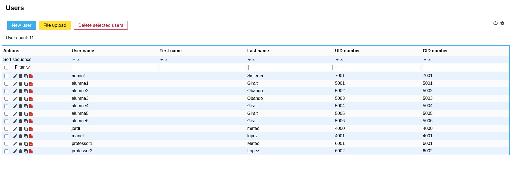
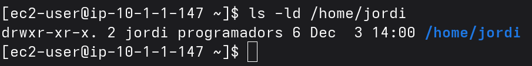

# Practica3-AMSA-LDAP

Pràctica realitzada en grup per Xavier Giralt i Jonas Obando.

La nostra pràctica utilitza fitxers CloudFormation que després de ser executats des d'AWS, executen scripts de Ansible que permeten configurar automàticament tant el client com el servidor.

### Us dels scripts

Per utilitzar l'script del servidor únicament cal indicar la clau ssh que es vol utilitzar i la contrasenya pel admin de LDAP:

Despres de una estona, tot s'haurà configurat automaticament i tindrem el servidor LDAP amb la contrasenya especificada i el servidor LAM (amb contrasenya 1234).

Per al client únicament hem d'indicar el hostname del Servidor perquè es pugui connectar i el nombre de clients que volem crear.

Un cop s'hagi configurat podem veure que els usuaris es sincronitzen correctament

